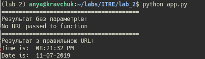

# Lab_3: Автоматизація. Знайомство з CI/CD

* Ubuntu
* git, make, Python 3.7, PIP;

## What to do

1. Створила папку lab_2 та створила Readme файл.

2. За допомогою PIP встановила __pipenv__ та створила ізольоване середовище. 

3. Встановила бібліотеку requests та ntplib.

4. Додала файл app.py за зразком: 

5. Запустила app.py: 

6. Встановила pytest. Додала файли.

7. Запустила pytest: 

8. Написала функцію перевірки часу доби переконалась, що програма працює запустивши її: 

9. Написала тест для перевірки правильності виконання: ![](./photo/testpy.png

10. Перенаправила результати тестів у файл __results.txt__ та результат виконання свмої програми в кінець файлу. Зробила це командами перенаправлення стандартного потоку виводу __">"__ для запису, та __">>"__ для доповнення в кінець файлу.

11. Зробила коміт зі змінами.

12. Заповнила Makfile

13. Закомітила зміни
