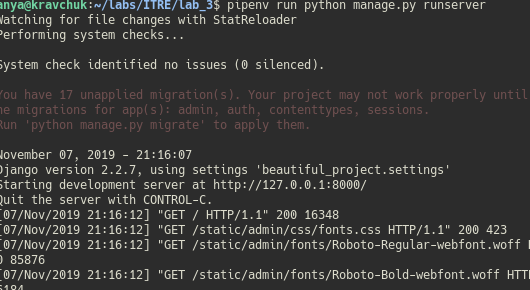
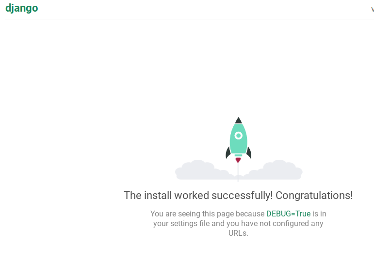
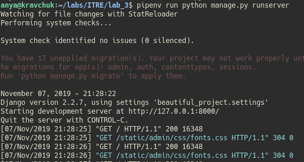
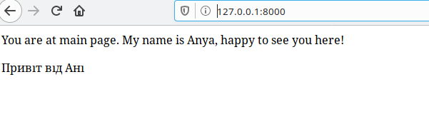
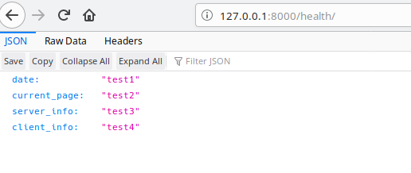

# Lab_3: Вступ до моніторингу.

* :heavy_check_mark: середовище з інстальованим Python / pip / pipenv;
* :heavy_check_mark: будь-який WEB-браузер;

## What to do.

1. Створила папку з назвою лаб. роботи. Ініціалізувала середовище pipenv. Інсталювала необхідні пакети `pipenv --python 3.7` `python install django`

2. Створила заготовку django-template командою `pipenv run django-admin startproject beautiful_project`. Винесла файли на рівень вище `mv beautiful_project/beautiful_project/* beautiful_project/`. `mv beautiful_project/manage.py ./`

3. Запустила сервер та переконалась, що все працює:  

4. Створила коміт з базовим темплейтом. Файл `db.sqlite3` виключила з коміту шляхом додавання його назви до файлу `.gitignore`.

5. Створила темплейт додатку, назвала `main`.

6. Створила папку __main/templates__ та додала файл __main/templates/main.html__, а також файл __main/urls.py__. Закомітила зміни.

7. Відредагувала файл __beautiful_project/settings.py__ та внесла зміни у файл __beautiful_project/urls.py__

8. Додала __main/views.py__

9. Заповнила __main/urls.py__ за зразком

10. Запустила сервер:  

11. Інсталювала бібліотеку `pipenv install requests`

12. Відкрила сторінку health, дані відображаются (видно на фото вище).

13. (ЗАХИСТ)
    1. Модифікувала функцію health
    2. Дописала функціонал для виводу повідомлення про недоступність сайту
    3. Зробила, щоб програма працювала безперервно та раз в 1хв перевіряла доступність сайту
    4. Спростила роботу з середовищем через Pipfile. Додала аліаси на запуск серверу та моніторингу. `pipenv run server` та `pipenv run monitor`

14. Закомітила всі зміни, включаючи логи сервера

15. Створила пул-реквест.
