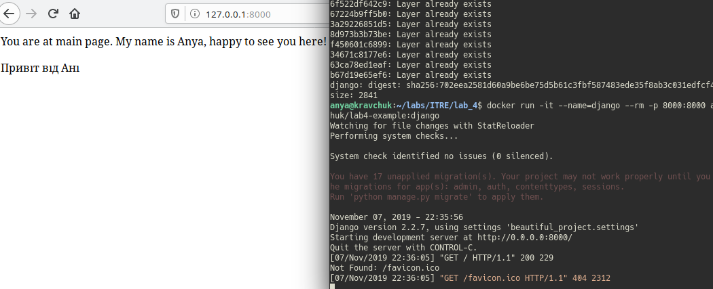

# Lab_4: Робота з Docker

* :heavy_check_mark: віртуальна машина (Ubuntu) з інстальованим Docker;

## What to do.

1. Перевірила чи правильно встановила докер та перенаправила вивід команд у файл: `(docker -v && docker -h && docker docker/whalesay cowsay Docker is fun) > my_work.log`

2. Створила імедж з Django сайтом з попередньої роботи. Виконала команди:
```Bash
    docker pull python:3.7-slim
```
   - Створила файл `Dockerfile` та скопіювала дані зі зразка. Замінила посилання на власний гіт-репозиторій та закомітила даний файл.
    
3. Створила власний репозиторій на DockerHub. Посилання: https://hub.docker.com/r/annkravchuk/lab4-example/tags

4. Виконала build імеджа та завантажила його до репозиторію.

5. Запустила контейнер командою `docker run -it --name=django --rm -p 8000:8000 annkravchuk/lab4-example:django`


6. Створила ще один контейнер для програми моніторингу:
    * Додала новий докер-файл з назвою `Dockerfile.monitoring`
    * Виконала build для Dockerfile.monitoring
    * запустила одночасно 2 контейнери. Вказала аргумент `--net=host` для того щоб програма моніторингу бачила сайт
    * Витягнула логи (server.log) командами:
```Bash
    docker volume create kravch
    docker run -it --name=monitoring --rm -p 8000:8000 -v kravch:/app annkravchuk/lab4-example:django
    docker cp monitoring:/app/server.log ./
```
7. Закомітила всі зміни
