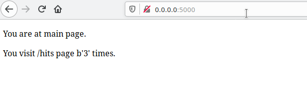

# Lab_5: Автоматизація за допомогою Makefile VS Docker Compose

## what to do.

### Варіант 1: Makefile

1. Створила папку `my_app` та `tests`. Скопіювала файли з репозиторію у відповідні папки. Переглянула файл `requirements.txt` - цей файл містить назви бібліотек які необхідно встановити.

2. Перевірила проект на працездатність. Завантажила та встановила `redis`-сервер. Прописала в системному файлі `hosts` правило для преренаправлення запитів за адресою хоста `redis` на локальну машину (loopback address). -> `127.0.0.1 redis`. Також запустила сервіс `systemctl start redis`. Після цього сайт успішно запускається.
- Ініціалізувала окреме середовище в папці з тестами. Створила папку `my_app/logs`, тому, що при переході на сторінку логів виникає помилка доступу до файлу, файл програма може створити, а папку вона не створює, тому створила папку в ручну. Успішне проходження тестів також від цього залежить. Після тестового запуску видалила папку logs

3. Видалила всі файли, що створились в процесі запуску. Створила два докер-файли та заповнила їх за зразком. Також створила Makefile для автоматизації процесу розгортки проекту.

4. Ознайомилась з вмістом файлів. Короткий опис файлу __Makefile__:
    - можливі команди: app, tests, run, test-app, docker-prune
    - `app` - створення імеджу з додатком. `tests` - створення імеджу з тестами.
    - `run` - запуск всіх імеджів, необхідних для роботи сервера. (redis та flask)
    - `test-app` - запуск контейнеру з тестами
    - `docker-prune` - очистка не використовуваних ресурсів docker

5. Використовуючи команди `make app` та `make tests` створила імеджі для тестів та серверу. Запустила командою `make run` сервер та командою `make test-app` - тести, та перевірила роботу. Скріншоти:

6. Почистила ресурси командою `make docker-prune`:

7. Створила директиву для завантаження імеджів до свого репозиторію: `make push-hub` та завантажила їх виконавши цю команду.

8. Видалила всі локальлні імеджі та створила директиву для їх видалення `make del-img`:

### Варіант 2: docker-compose

1. Створила файл `docker-compose` та скопіювала код зразка з репозиторію у файл. В даному прикладі створюються дві мережі. Моя думка: одна мережа внутрішня для комунікації між собою сервера та "бази даних" (redis-серверу), тобто це внутрішні ресурси, доступу до яких зовні не має бути, тільки між зазначеними контейнерами.

2. Встановила docker-compose та перевірила на працездатність. Запустила проект.

3. Перевірила чи все правильно запустилось, зайшла на адресу локального хоста (127.0.0.1:80) (порт 80 вказаний як зовнішній порт контейнера в docker-compose.yml):

4. Компоуз створив наступні імеджі з такими тегами:

5. Замінила теги на свої, почистила імеджі за допомогою команди `make del-img` та перезапустила компоузер `docker-compose -p lab5 up`.

6. Зупинила проект та почистила ресурси створені docker-compose. Команда `docker-compose down`.

7. Завантажила створені імеджі до Docker Hub

8. На мою думку для контейнерів краще все-таки використовувати docker-compose - такий метод дозволяє набагато коротше та простіше описати необхідні властивості проекту, одним махом створити мережі та необхідні ресурси. Робити через makefile трошки довше і трошки інша реалізація, не такий простий вигляд носять команди і більше потрібно прописувати. Тут вже кому як зручно.

9. Створила `docker-compose.yml` для попередньої лабораторної роботи та помістила файл у відповідну папку (lab_4).

